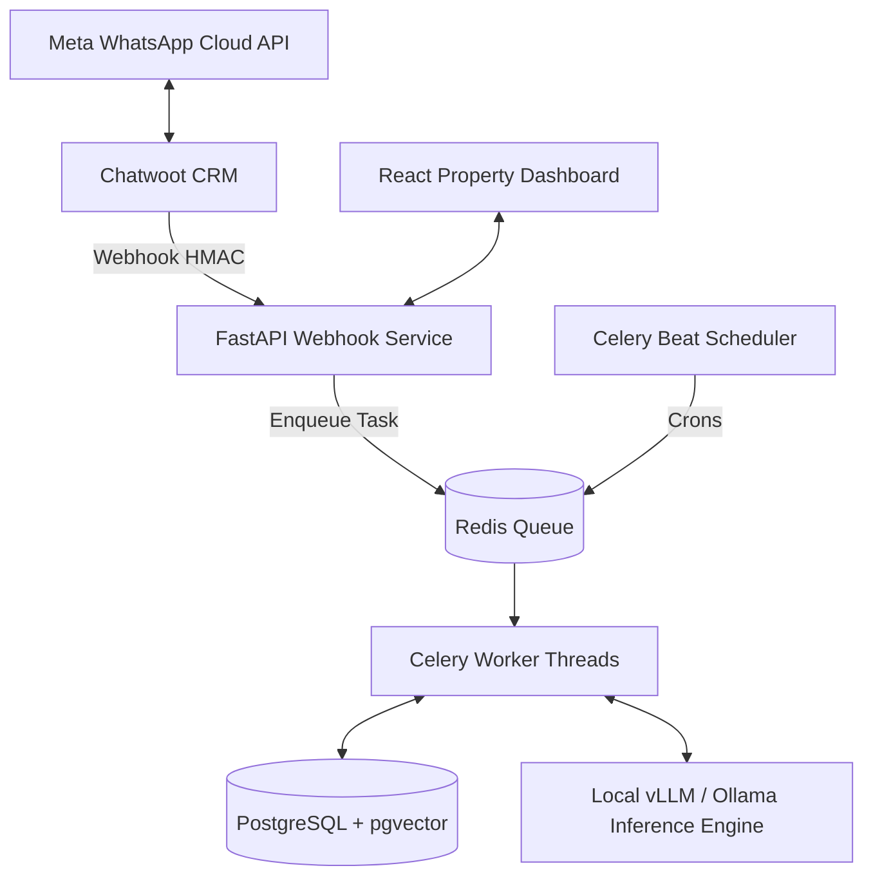

# Home IHC Real Estate WhatsApp AI CRM

Automated WhatsApp CRM solution tailored for real estate operations at **Home IHC Sdn. Bhd.** ([BentongLand.com.my](https://bentongland.com.my/)). Built around Irene Leong's agency persona (+6011-65144931, REN), the platform delivers autonomous lead qualification, dynamic sparse JSON conversational inference, automated property viewing acknowledgement generation, multi-page vector PDF transcripts, weekly business reporting, and seamless human agent handover via Chatwoot.

---

## 1. System Architecture

The system operates on an on-premise, privacy-first containerized architecture running on dedicated AI hardware (AMD Ryzen 7 7800X3D + NVIDIA RTX 5070 Ti 16GB VRAM):



### Core Components

- **FastAPI Webhook & REST API (`backend/app/api/`)**: High-throughput webhook ingestion verifying Chatwoot timestamped HMAC signatures, lead management endpoints, property search APIs, and RBAC authentication.
- **Celery Worker & Beat (`backend/app/worker/`)**: Asynchronous task processing (multi-threaded concurrency) with Celery Beat running scheduled background daemons.
- **Local AI Inference (`vLLM / Ollama`)**: On-premise LLM execution hosting quantized models (e.g. Qwen 2.5 / Llama 3 / Gemma 2) providing zero external token costs and absolute PII data sovereignty.
- **PostgreSQL with `pgvector`**: 5-aspect property embeddings (`embedding_location`, `embedding_specs`, `embedding_features`, `embedding_suitability`, `embedding_overview`) queried via native cosine distance (`<=>`).
- **Chatwoot Customer Engagement Suite**: Shared inbox for human agents with in-conversation slash command dispatch and bi-directional synchronization.
- **React Management Dashboard (`property-dashboard/`)**: Vite + React 19 administrative portal with RBAC (Admin, Agent, Viewer), lead inspection modal, and environment-aware status monitoring.

---

## 2. Key Capabilities & Domain Services

### A. Conversational AI Engine & Dynamic Token Optimization
- **Response-First Sparse JSON**: The LLM outputs `"response"` first to guarantee complete message delivery under token envelopes, followed by dynamic keys (`"intent"`, `"extracted"`, `"handover"`). Static empty metadata keys are omitted, cutting overhead from ~180 tokens to ~15 tokens per turn.
- **Literal Escape Sequence Decoding**: Fallback regex parser unescapes `\n`, `\"`, and `\\` to eliminate literal newline artifacts in WhatsApp client bubbles.
- **Category Partitioning & Consultative Off-Market Protocol**: When a customer inquires for residential property (e.g., Semi-D, Bungalow, Terrace), commercial and shoplot listings are strictly partitioned out. If 0 listings exist, Irene smoothly pivots to an off-market sourcing consultation.
- **Anti-Repetition & Anti-Amnesia Guards**: Multi-layer detection prevents re-introducing Irene Leong mid-conversation. `/reset` command executes a deep session purge across Redis and database state.

### B. Viewing Acknowledgement Engine (`ViewingAcknowledgementEngine`)
- Generates official 22-field Customer Property Viewing Acknowledgement forms in `.docx` and `.pdf` formats.
- **OpenXML Border Stabilization**: Injects explicit `<w:tblBorders>` into table properties, preventing border stripping during headless LibreOffice conversion.
- **16pt Bold Checkboxes & Parity Alignment**: Full visual parity matching historical agency documents, right-aligned header dates, widened honorific columns (`MRS`), borderless 2-column signature blocks, and dynamic record-based form numbering (`0190`, `0191`, `...`).
- **Zero Hallucination Defaults**: Individual inquiries remain free of corporate placeholders (company name, address, car plate) unless explicitly provided by the customer.

### C. Conversation Transcript Engine (`ConversationTranscriptEngine`)
- Multi-page vector PDF generator powered by PyMuPDF (`fitz`).
- Full CJK typography support for multilingual customer dialogues (English, Malay, Chinese).
- Dynamic pagination with message bubble geometry and direct WhatsApp dispatch.

### D. Automated Reporting Engine (`ReportingEngine`)
- OOP reporting engine generating binary OpenXML `.xlsx` spreadsheets with standard library `zipfile` fallback.
- Celery Beat automatically dispatches weekly reports (`Buyer Database.xlsx` and `Owner Database.xlsx`) every Monday at 09:00 MYT.

### E. Lead Qualification & Nurturing (`LeadNurturingManager`)
- Automated classification into Hot (18h–72h), Warm (3–7d), and Cold (7–14d) follow-up cadences.
- Strict enforcement of Meta WhatsApp 24-hour Customer Care Policy window (direct messaging $\le 24$h; internal Chatwoot private notes $> 24$h).

---

## 3. Chatwoot In-Conversation Commands

Human agents can execute backend workflows directly from Chatwoot private notes:

| Command | Action |
|---|---|
| `/acknowledgement` | Generates and posts the Viewing Acknowledgement PDF internally in Chatwoot notes. |
| `/acknowledgement send` | Generates and dispatches the Viewing Acknowledgement PDF directly to the customer's WhatsApp chat. |
| `/transcript` | Generates and attaches the complete conversational transcript PDF internally. |
| `/transcript send` | Generates and dispatches the conversational transcript PDF to the customer on WhatsApp. |
| `/reset` | Deeply purges the Redis session and resets `bypass_ai=False`, restarting AI engagement cleanly. |

---

## 4. Deployment & Infrastructure

The application runs in two isolated Docker Compose stacks connected via an encrypted Tailscale mesh network:

### Environments

- **Staging (`docker-compose.staging.yml`)**:
  - API: Port `8001`
  - Frontend Dashboard: Port `3001`
  - Worker: `whatsapp_ai_worker_staging`
  - Beat: `whatsapp_ai_beat_staging`
  - Target: `~/whatsapp-ai-staging`
- **Production (`docker-compose.production.yml`)**:
  - API: Port `8080` (internally mapped to `8000`)
  - Frontend Dashboard: Port `3002`
  - Worker: `whatsapp_ai_worker_production`
  - Beat: `whatsapp_ai_beat_production`
  - Target: `~/whatsapp-ai-prod`

### CI/CD Quality Gates (`.github/workflows/`)

Deployments run through GitHub Actions runners with strict automated quality gates:
1. **Unit & Regression Test Gate**: `python -m unittest tests/test_*.py` (81 automated tests).
2. **Conversational Backtesting Gate**: `python scripts/run_backtest.py` (replayable multi-turn dialogue scenarios).
3. **Tailscale VPN Tunnel**: Zero direct inbound open ports on the physical router.
4. **Zero-Downtime Rolling Update**: Container builds execute with `--remove-orphans` and health telemetry verification.

---

## 5. Testing & Verification

Execute tests from `backend/`:

```bash
# Run complete test suite (81 tests)
cd backend && python -m unittest tests/test_*.py

# Run conversational backtest harness
cd backend && python scripts/run_backtest.py

# Session reset utility
python scripts/reset_customer_session.py --phone +60123456789
```
